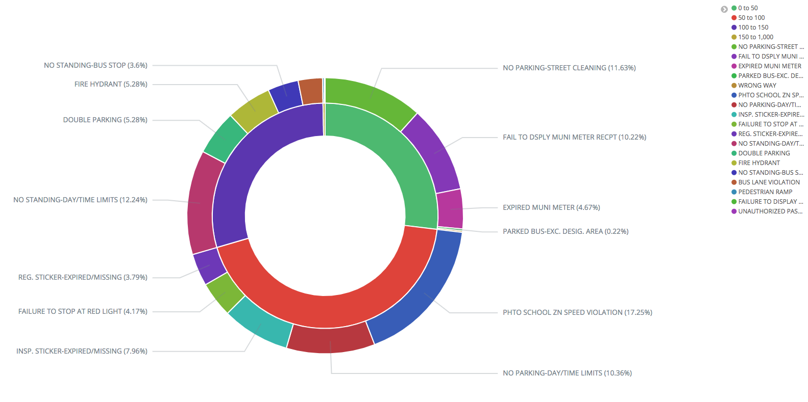
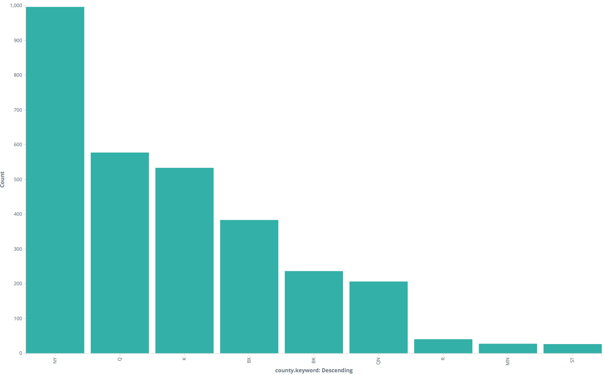
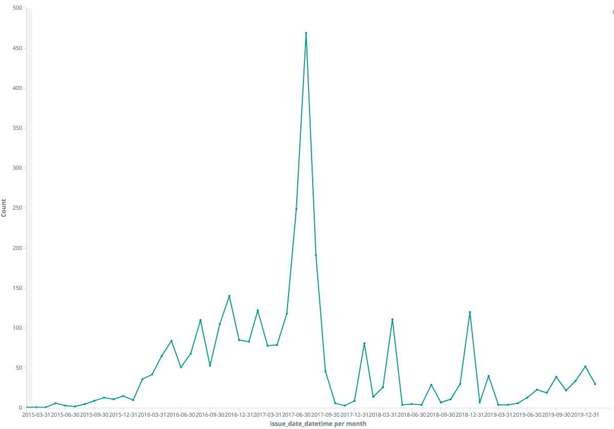
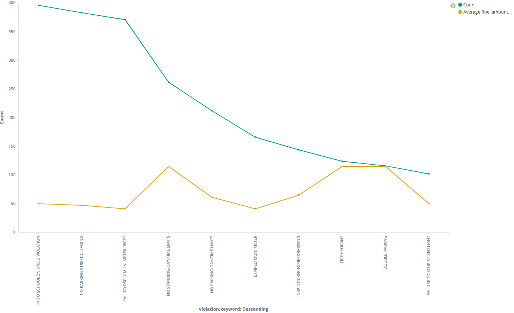

# STA 9760 Project - Analyzing Millions of NYC Parking Violations

## Project Introduction

In this project, I will be performing data analysis on the Open Parking and Camera Violations data, which is obtained from the NYC Open Data.

## Part 1 - Python Scripting

In the part 1 of the project, I will be setting up a python command line interface that can connect to the OPCV API. First I created a Dockerfile that contains instructions on how to build the images.

```
# This is my Dockerfile
FROM python:3.7

WORKDIR /app

COPY requirements.txt /app
COPY . /app

RUN pip install -r requirements.txt
```

The requirements.txt file contains the dependency that I need in this project. In this case, there is only one dependency which is the Pypl's sodapy module. This module allows me to the Socrata API, which I use to get the data. <br />
<br />
Then I use the following command to build the Docker image.

```
docker build -t bigdata1:1.0 .
```

Then I can use the following command to run my code.

```
docker run -e APP_KEY={app_key} -t bigdata1:1.0 python main.py --page_size=2 --num_pages=3
```

- APP_KEY: The app_key that is used in the script to get the data using the API

- bigdata1: The name of the docker image.

- --page_size: This argument is **required**. Number of records to request from each API call.

- --num_pages: This argument is **optional**. Number of times to make a API call. If this argument is not given, the script will keep requesting data until all the data has been exhausted.

- --output: This argument is **optional**. If not given, the script will print the results to stdout. If given, the script will write the data to a file.

To use my Docker image and run my code on EC2, first you have to login to Docker from EC2 and pull my image.

```
sudo docker pull henrychon/bigdata1:1.1
```

Run the following command on EC2 to run the code

```
sudo docker run -e APP_KEY={app_key} -t henrychon/bigdata1:1.1 python main.py --page_size=2 --num_pages=3 --output.txt
```

<br />

## Part 2 - Loading into ElasticSearch

Run the following command to load the data into ElasticSearch

```
docker-compose run -e APP_KEY={app_key} pyth_project python main.py --page_size=200 --num_page=10
```

<br />

## Part 3 - Visualizing and Analysis on Kibana

#### 1. Proportion of Different Range of Fine Amount and Types of Violation

   
   This graph shows the propotions of the fine amount and the different type of violations. <br>
   From this graph, we can see that the top range of fine amount is $50 to $100. 43.54% of tickets are in this range. 29.23% and 26.92% of tickets is in the range of $100 to $150 and $0 to $50. respectively. Only 0.3% of the tickets has fine amount more that $150.

#### 2. Top 10 Counties with the Highest Number of Tickets

   
   This graph shows the top 10 county that has the highest number of tickets in the past 5 years. <br>
   From this graph, we can see that the county that has the highest number of tickets is NY, which the number of tickets is 997. This is almost twice as many as the number of tickets of the second county, Q, which has 578 tickets from the past 5 years.

#### 3. Monthly Number of Violations

   
   This graph shows the number of tickets in each month for the past 5 years. <br>
   If we look at the beginning of the data, we could see that there are only few case in each month in 2015. For example, in June 2015, there were only 6 tickets. These numbers are totally unrealistic. This could be due to the fact that there are some missing data in the dataset. <br>
   Also, we could see there are lots of fluctuation between months. For example, August 2017 has  469 tickets. But in the next month September 2017, the number of tickets drops to 191, which is less than half of the previous month.

#### 4. Top 10 Violations with Corresponding Average Fine Amount

   
   This graph shows the top 10 ticket violatoins with the corresponding average fine amount. <br>
   We see that "photo school zone speed violation" is the top violation, which has 396 tickets issued. The average fine amount of this violation is $50, which however is lower than couple of other violations in the top 10 group. The violation from the top 10 that has the highest average fine amount are "fire hydrant" and "double parking". The average fine of these two violations is $115.
